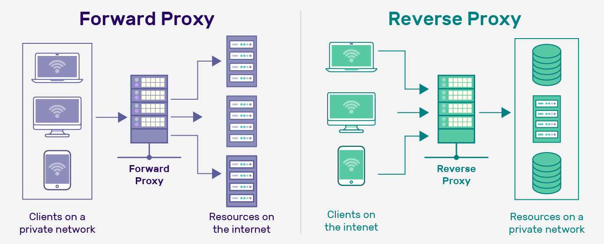

# NGINX Explained 🚀

NGINX (pronounced **Engine-X**) is a super popular tool used as both a **web server** and a **reverse proxy server**. It’s fast, reliable, and widely loved! 🌟

---

## 📂 Directory Structure
Here’s where NGINX keeps its important files:

1. **Configuration Files** 📝  
   Found in: `/etc/nginx`  
   This is where NGINX settings live.

2. **HTML Files** 🌐  
   Found in: `/usr/share/nginx/html`  
   Default location for website files (like HTML pages).

3. **Logs** 📜  
   Found in: `/var/log/nginx`  
   Stores records of what NGINX is doing (handy for troubleshooting!).

4. **Main Config File** ⚙️  
   Found in: `/etc/nginx/nginx.conf`  
   The heart of NGINX settings, controlling how it works.

---

## 🔄 Types of Proxies
NGINX can work as two types of proxies: **Forward Proxy** and **Reverse Proxy**. 

Here’s the difference:

### 🌍 Forward Proxy
- **What it does**: Acts like a middleman that the client (user) chooses to use. 🕵️  
- **Key Features**:  
  - **Hides Client Identity**: Keeps the user’s IP address secret for privacy. 🕶️  
  - **Controls Access**: Blocks certain websites or content from being accessed. 🚫  
  - **Caching**: Saves frequently visited content to load it faster next time. ⚡  
- **Example**: A company uses a forward proxy to control what websites employees can visit.

### 🔒 Reverse Proxy
- **What it does**: Sits in front of servers, and clients don’t even know it’s there! 🛡️  
- **Key Features**:  
  - **Load Balancing**: Spreads traffic across multiple servers to keep things running smoothly. ⚖️  
  - **Security**: Hides backend servers and their IP addresses to protect them. 🔐  
  - **SSL Termination**: Handles encryption (SSL/TLS) so backend servers don’t have to. 🛠️  
- **Example**: A website uses a reverse proxy to manage traffic and keep servers secure.

---

> **Fun Fact**: Think of a **Forward Proxy** as a gatekeeper for users and a **Reverse Proxy** as a bodyguard for servers! 🏰

